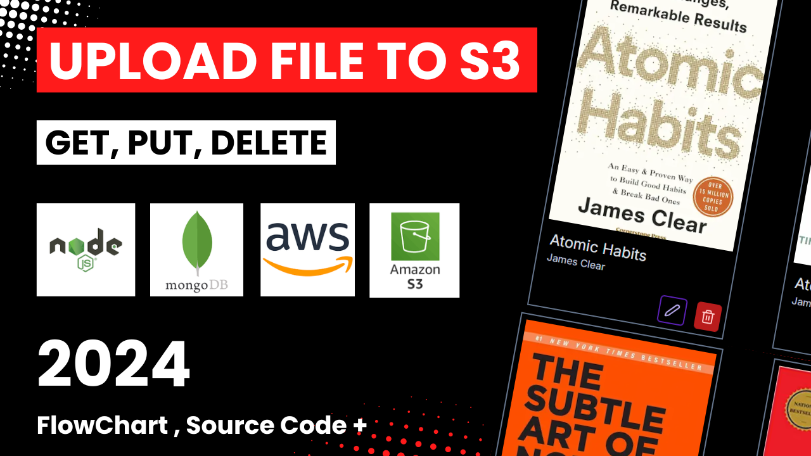
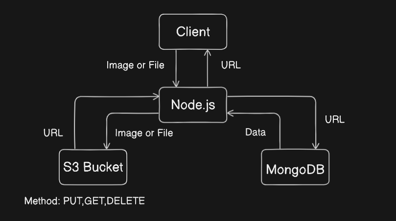

# Book Store

Book Store Application where users can Upload, Retireve and Delete Book Details.

## Description

This is a MENN Stack web application where book images are stored in an AWS S3 bucket, the backend is built using Node.js and Express.js, and MongoDB is used as the database. This project allows users to upload, retrieve, and delete book images, with data securely stored and managed through the backend.

## Table of Content

- [Key Feature](#key-features-of-this-project-include)
- [Technologies Used](#technologies-used)
- [FlowChart](#flowchart)
- [Prerequisites](#prerequisites)
- [Installation](#installation)
- [Screen Shot](#screen-shot)

## DEMO VIDEO

Link: https://youtu.be/



### Key features of this project include:

- **Upload Book Images**: Users can upload book images, which are stored in an S3 bucket.
- **Retrieve Book Images**: Fetch stored images from the S3 bucket.
- **Delete Book Images**: Remove images from the S3 bucket as needed.
- **Manage Books**: Add, view, update, and delete book records in the database.

### Technologies Used

- **Backend**: Node.js, Express.js, AWS S3 SDK
- **Database**: MongoDB
- **File Storage**: AWS S3 bucket
- **Frontend**: Next.js

## FlowChart


The diagram illustrates a system architecture for managing file or image uploads using Node.js, S3 Bucket, and MongoDB.

- The client sends an image or file to the Node.js server.
- The server uploads the file to the S3 Bucket and saves its URL in MongoDB.
- The client can request the URL to access the file or perform other operations like retrieving or deleting the file.

## Prerequisites

Node v20.10.0\
Npm v10.8.1

## Installation

**1. Clone the repository:**

```Bash
git clone https://github.com/theadiga27/node-s3.git
cd web-hosting
```

**2. Install dependencies:**

1. Backend dependencies

```Bash
npm install
```

2. Frontend dependencies

```
cd client
npm install
```

**3. Change a `.env.example` file to `.env`**

1. Backend `.env` in the root directory
2. Frontend `.env` in the client directory

**4. Run the server**

1. Backend server

```
npm start
```

2. Frontend server

```
cd client
npm run dev
```

## Screen Shot


